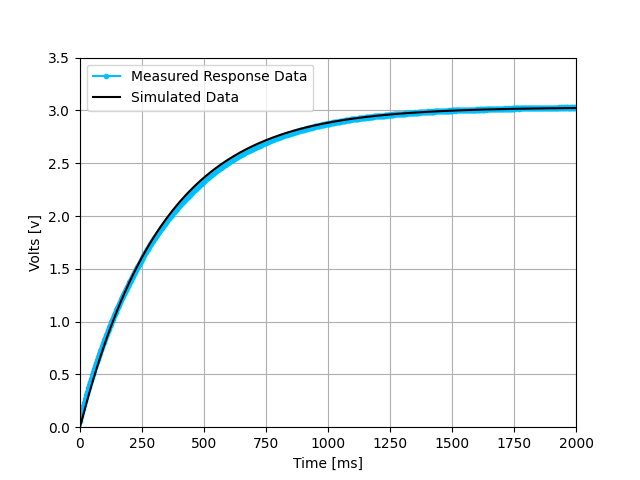

This folder contains lab code for ME-405

This program uses a simple GUI to control the Nucleo board and generate a step response in the circuit below.
An input voltage is applied and the repsonse due to the capacitor is measured and logged on the board. 
Once the step response test has concluded, the data is read through a serial connection to the user laptop and graphed against a theoretical response. 

Figure 1. Circuit diagram for step response test. 

Figure 2. Example step response result plotted against the theoretical curve. 